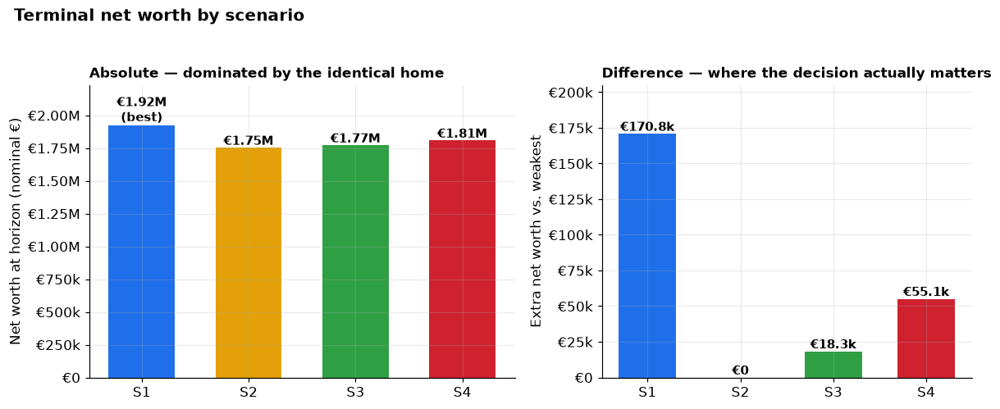
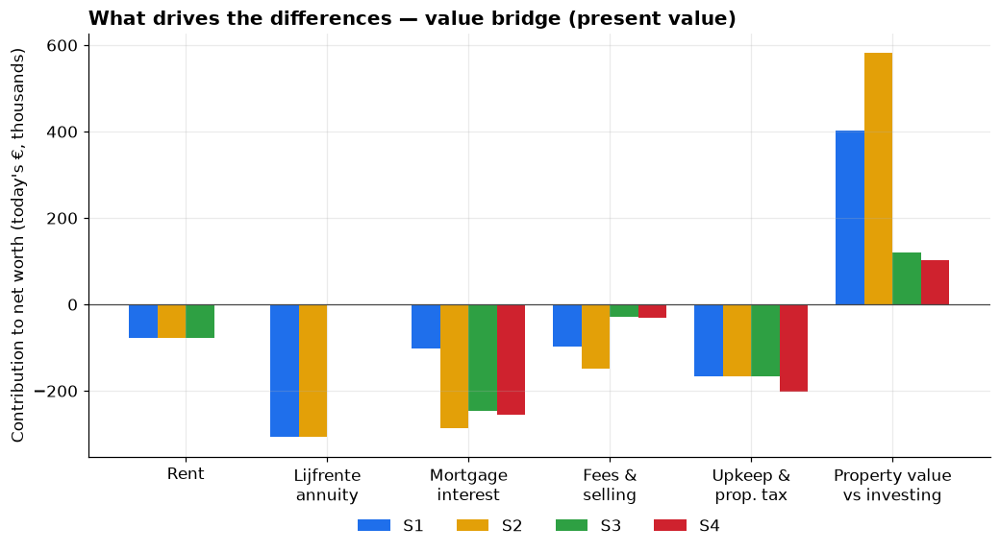
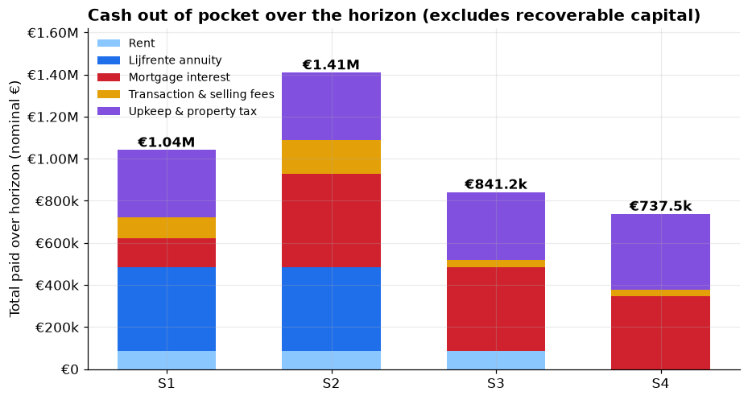
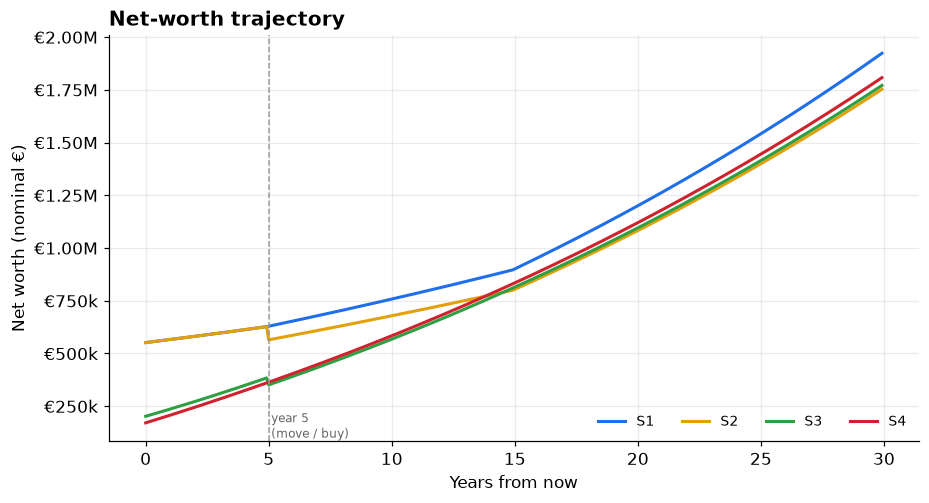
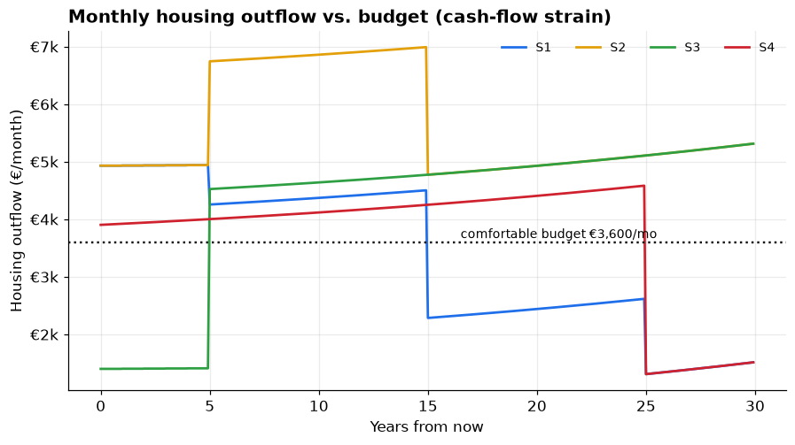
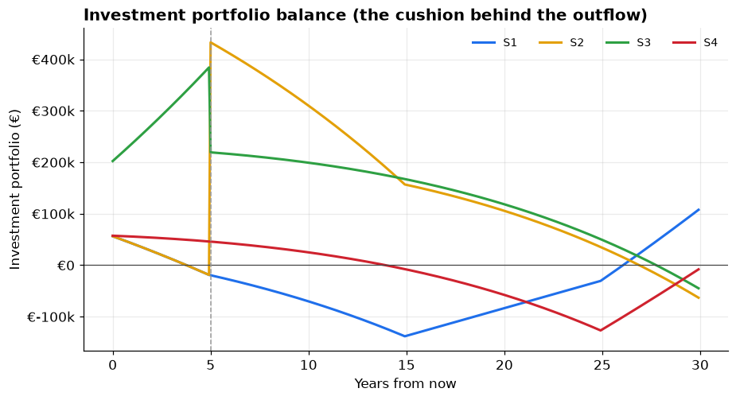
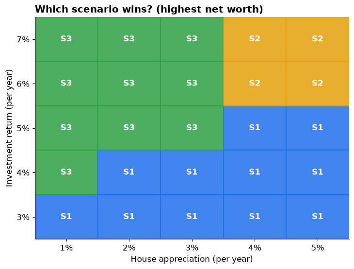
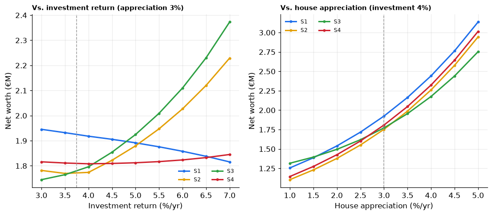

# Buy, rent, or lijfrente? A four-scenario comparison

*Personal-finance decision analysis · prepared 11 Jul 2026 · horizon 30 years · all figures in EUR · base case: 3.75% investing vs 3% appreciation*

**Scenarios compared**

| | Strategy |
|---|---|
| **S1** | Buy the lijfrente home now, rent for 5 years, then move into the lijfrente home and keep it. |
| **S2** | Buy the lijfrente home now, rent for 5 years, then sell the lijfrente home and buy a normal home. |
| **S3** | Rent for 5 years, then buy a normal home. |
| **S4** | Buy a normal home now and live in it. |

## The answer, up front

> Under the base-case assumptions, **Lijfrente + rent, then move in (S1)** maximises long-run wealth (€1,923,517 at 30y), and **Lijfrente + rent, then sell & buy normal (S2)** is weakest (€1,752,693).
>
> Ranking: **S1** (€1,923,517) > **S4** (€1,807,788) > **S3** (€1,770,981) > **S2** (€1,752,693). The gap between best and worst is **€170,824** (~10% of net worth). All four scenarios end owning the **same debt-free home**, so *every difference is opportunity cost, financing and fees — not the house itself.*

**Two findings dominate:**

1. **The lijfrente is priced attractively.** Its total outlay (€699,600 = €300,000 up front + €2,220 × 180 months) is *below* the €750,000 market value, is spread over 15 years, and needs almost no mortgage — effectively cheap financing for the very same asset. Conversely, **buying a normal home now (S4)** is the most expensive way to own the identical house: the biggest mortgage and the most interest (€345,776).
2. **The two leaders — S1 and S4 — are within €115,728 of each other** (~6%), and which one wins comes down to a single comparison: **your investment return (3.75%) vs. your mortgage rate (3.75%).** With the *rational* financing rule, whenever investing beats the mortgage you borrow the maximum and keep cash invested — which favours the rent-and-invest route (S3); when the mortgage is dearer you pay it down, which favours the near-mortgage-free lijfrente (S1). Here investing trails the mortgage, so **S1 leads**. House appreciation vs. your investment return is the second lever (it decides rent-vs-own timing). See Exhibits 7–8.

## 1 · How much wealth each path builds

*Exhibit 1 — Net worth at the 30-year horizon. Left: absolute values are nearly identical because every scenario owns the same fully paid-off home (worth €1,815,968). Right: the same data as a difference vs. the weakest scenario — this is where the decision actually matters.*

## 2 · Why they differ — the value bridge

Only factors that **differ** between scenarios are shown, in today's money (present value, discounted at the investment return so each euro is scored at its opportunity cost). Bars below zero destroy value; the *property value vs investing* bar is the net payoff from owning bricks after charging the opportunity cost of the equity tied up in them.

*Exhibit 2 — Present-value contribution of each driver. Note: for S1/S2 the lijfrente annuity (shown separately) is effectively the instalment price of the home, so read it together with the property-value bar.*

*Exhibit 3 — Total cash actually paid out over the horizon, by category (nominal). Excludes down payment and mortgage principal, which are recoverable as home equity. Clearest view of the €2,220/mo annuity, rent and interest burden.*

> **Watch the paradox:** S2 has the *lowest* cash out of pocket (€1,409,146) yet the *lowest* net worth — because it sinks the most capital into a home appreciating at 3% instead of investments earning 3.75%. Out-of-pocket cost and wealth are not the same thing; opportunity cost is invisible in a bank statement.

## 3 · The numbers

Legend: **S1** = Lijfrente + rent, then move in · **S2** = Lijfrente + rent, then sell & buy normal · **S3** = Rent, then buy normal · **S4** = Buy normal now.

| Metric | **S1 ✅** | S2 | S3 | S4 |
|---|---|---|---|---|
| Net worth at horizon (nominal) | €1,923,517 | €1,752,693 | €1,770,981 | €1,807,788 |
| Net worth in today's money (PV) | €639,418 | €582,633 | €588,712 | €600,948 |
| Peak monthly housing outflow | €4,940 | €6,991 | €5,313 | €4,583 |
| Peak cumulative funding gap \* | €138,228 | €63,275 | €44,987 | €126,892 |
| Total mortgage interest | €138,310 | €445,638 | €400,849 | €345,776 |
| Total rent paid | €84,278 | €84,278 | €84,278 | €0 |
| Total lijfrente annuity | €399,600 | €399,600 | €0 | €0 |
| Total transaction/selling fees | €97,500 | €158,298 | €34,778 | €30,000 |
| Total upkeep & property tax | €321,333 | €321,333 | €321,333 | €361,696 |

✅ = recommended scenario (Lijfrente + rent, then move in). Note that lower is better for the cost rows, so the recommended column is *not* the smallest in every row — the whole point is that it makes the best overall trade-off.

\* Peak cumulative funding gap = the largest amount by which required spending has exceeded the €3,600/mo budget on a compounding basis, i.e. extra savings/borrowing needed on top of budget. A red flag for *affordability*, not for final wealth.

## 4 · Timing: wealth and cash-flow over the years

*Exhibit 4 — Net-worth trajectory. Lines converge as homes are paid off and appreciate identically; the ordering is set by investing behaviour along the way.*

*Exhibit 5 — Monthly housing outflow vs. the €3,600 budget. A high line is not the same as unaffordable: when the mortgage is cheaper than investing, the rational choice is to keep cash invested and let it cover the gap. S2 looks heavy (small mortgage + the continuing €2,220/mo annuity), but its true strain is small — its funding gap is only €63,275 because the home-1 sale proceeds sit in the portfolio (Exhibit 6) and cover it.*

*Exhibit 6 — The investment-portfolio balance that sits behind the outflow. This is the cushion that funds any month where housing costs exceed the €3,600 budget. A line dipping below zero is the real red flag (money you'd have to borrow on top of the budget); staying well above zero means the high outflow is comfortably self-funded.*

## 5 · What could change the answer — sensitivity

The ranking hinges almost entirely on two uncertain numbers: what you earn investing, and how fast houses appreciate.

*Exhibit 7 — Winning scenario by investment return (rows) and house appreciation (columns); your base case is outlined. When appreciation approaches or exceeds investment return, owning property earlier/cheaper (S1/S2) takes over.*

*Exhibit 8 — Net worth of each scenario as one assumption varies (the other held at base). Where lines cross, the recommendation changes.*

## 6 · Risks & qualitative considerations

Ordered best-to-worst on the base-case finances. The financial gaps are modest (~10%) relative to these non-financial factors, which may matter more.

### S1 · Lijfrente + rent, then move in

*Buy the lijfrente home now, rent for 5 years, then move into the lijfrente home and keep it.*

- **Cash-flow strain (high).** For 5 years you pay rent *and* the annuity *and* a mortgage simultaneously — peak outflow €4,940/mo and a cumulative funding gap up to €138,228 that must come from extra savings or income beyond the €3.6k budget.
- **5-year lock-in (high).** You are committed to the lijfrente home and its location years before you can live there. If your life plans change (job, family, city) you are stuck or must sell into scenario 2.
- **Transaction-tax risk (high).** The home is not your occupied sole dwelling at purchase, so it likely attracts the ~12% registration duty, not the 2% own-home rate. Confirm with a notary — this is ~€75k of swing.
- **Counterparty / annuity risk (medium).** The construct depends on the seller and contract terms (indexation, what happens on early death, security on the property). Have the deed reviewed.
- **Upside.** You lock in today's price on a €750k home for a low up-front outlay and spread payments over 15 years — attractive if prices rise or you value certainty of that specific home.

### S4 · Buy normal now

*Buy a normal home now and live in it.*

- **Simplest & most secure (upside).** One transaction, no lock-in games, you own and live in your home immediately with full price certainty and stability.
- **Opportunity cost is the catch (high).** €200k plus every spare euro is tied up in an asset appreciating at 3% instead of investments at 3.75%; the biggest mortgage means €345,776 of interest.
- **Budget is tight long-term (medium).** Mortgage + rising upkeep can exceed the €3.6k budget in later years (funding gap up to €126,892), assuming the budget is not raised with income growth.
- **Wins if property outperforms.** If appreciation meets or beats your investment return, buying now becomes the strongest option — it has the most exposure to the home.

### S3 · Rent, then buy normal

*Rent for 5 years, then buy a normal home.*

- **Lowest strain, most flexible (upside).** Comfortably within budget (peak €5,313/mo, no funding gap). Renting keeps you mobile for 5 years and your €200k stays invested and compounding.
- **Timing / price risk (high).** You buy in 5 years at an unknown price. If homes appreciate faster than assumed you pay more and this advantage shrinks or reverses (see Exhibit 7).
- **Rate risk (medium).** The mortgage rate in 5 years is unknown; a materially higher rate would erode the edge.
- **Rent is 'lost' money (medium).** ≈€84k of rent over 5 years buys no equity — but the invested capital more than compensates while returns exceed appreciation.

### S2 · Lijfrente + rent, then sell & buy normal

*Buy the lijfrente home now, rent for 5 years, then sell the lijfrente home and buy a normal home.*

- **Worst on fees (high).** You pay two sets of transaction taxes plus selling costs — €158,298 total — and the largest mortgage interest bill. Double-churning property is expensive.
- **Annuity may continue after sale (high).** Unless the annuity legally transfers to the buyer, you keep paying €2,220/mo for the remaining 10 years on a home you no longer own. Model default assumes it continues; verify the contract.
- **Only makes sense as a fallback.** This is essentially scenario 1 gone wrong — choose it only if you deliberately want the lijfrente as a 5-year financial bridge and always intended to buy elsewhere.
- **Speculative CGT risk.** Selling a non-primary home within 5 years can trigger 16.5% capital-gains tax in Belgium. Timing the sale just past 5 years matters.

## 7 · Key assumptions

All of these live in `config.py` and can be changed centrally; re-run `python generate_report.py` to regenerate this report.

| Assumption | Value |
|---|---|
| Home value today (both homes) | €750,000 |
| Own cash capital | €200,000 |
| Comfortable monthly budget | €3,600 / month |
| Rent | €1,400 / month, indexed 2%/yr |
| Lijfrente up-front ('bouquet') | €300,000 |
| Lijfrente annuity | €2,220 / month for 15 years |
| Move-in delay (seller usufruct) | 5 years |
| Mortgage rate / term | 3.75% fixed over 25 years |
| Financing mode | `rational` — bank-minimum down payment; put down more only when the mortgage rate exceeds the investment return (then invest vs. pay-down is a real choice) |
| Bank minimum down payment | 15% of financed price |
| Buy costs — own home (Flanders) | 4% of price |
| Buy costs — lijfrente (non-primary) | 13% of value |
| Selling costs | 3% of price |
| Upkeep + insurance + property tax | 1% of value / yr (while occupying) |
| Investment return | 3.75% / yr (nominal) |
| House appreciation | 3% / yr (nominal) |
| Comparison horizon | 30 years |

## Method & caveats

**Method.** A monthly cash-flow engine simulates each scenario: housing outflows (rent, annuity, upkeep, mortgage principal & interest) are paid from a fixed monthly budget and any surplus is invested; shortfalls draw the portfolio down. Terminal net worth = investment portfolio + home equity. Because budget and starting cash are identical and all scenarios end owning the same debt-free home, the value bridge (Exhibit 2) is an exact reconciling decomposition of the net-worth differences (verified to the cent in code).

**Validated (Jul 2026).** Belgian 25y fixed mortgage market average ≈ 4.0% (we use your 3.75%); Flanders own-home transaction cost ≈ 4%, non-primary ≈ 13%; selling costs ≈ 3%; no capital-gains tax on a private main residence.

**Simplifications.** Fixed nominal budget (no income growth); portfolio surpluses and shortfalls both accrue at the investment return; the lijfrente annuity is treated as fixed and, after a sale, as continuing. Taxes on the lijfrente construct (registration base, primary-residence eligibility, CGT on an early sale) are the largest modelling uncertainties — confirm with a notary. Each is centrally tunable in `config.py`.

*Not financial advice — a planning model to compare structural trade-offs, not a prediction.*
